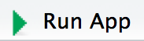

#Installation
## Linux
### R
From the terminal add an R repositry using the following command

`sudo echo "deb http://cran.rstudio.com/bin/linux/ubuntu xenial/" | sudo tee -a /etc/apt/sources.list`

Then add R to the Ubuntu Keyring  

`gpg --keyserver keyserver.ubuntu.com --recv-key E084DAB9`

and sudo add

`gpg -a --export E084DAB9 | sudo apt-key add -`

finally install base R 

`sudo apt-get update`  
`sudo apt-get install r-base r-base-dev`

### RStudio
It's easy enough to install the updated RStudio from the terminal. For the preview release just run:

`sudo apt-get install gdebi-core`  
`wget https://s3.amazonaws.com/rstudio-dailybuilds/rstudio-0.99.1251-amd64.deb`  
`sudo gdebi -n rstudio-0.99.1251-amd64.deb`  
`rm rstudio-0.99.1251-amd64.deb`

###Shiny
There are a few dependencies that must be installed for the app to run. The script `install_and_source_dependencies.R` will install and source any dependencies that have not currently been installed or loaded into the environment.

#Running the App

### From RStudio

To launch the app from and RStudio working environment, complete the following steps (in order):  

 1. Get the file *install\_and\_source\_dependenices.R* in your environment with `source("path/to/install_and_source_dependenices.R")`  
 
 2. Launch the app either with `shiny::runApp("path/to/app/root")` or open *ui.R* and click  
 
 

### From the Command Line 

For OSX and Linux users, change the permissions on the *main.R* to have executable powers. For OSX, use `chmod +x main.R`. Then launch the app form the terminal using `Rscript path/to/main.R`

#System Checks

##Yellowjacket Systems
 1. The following file must exist for the data acquisition to work:

 `/home/root/cronjobs/__init__.py`

 2. The following folder must exist for the rsync and IP scripts to work:
 
 `/home/root/log/`

 3. The IP address must be set on each yellowjacket system before ssh keys can be created. This is usually done on startup, but it can also be done manually by running:
 
 `python /home/root/cronjobs/setipaddress.py`
 
 Assuming a correct IP address is issued, the ssh script can be run:
 
 `/home/root/cronjobs/setup1time`

 That script can become excecutable if it is not already (`chmod u+x /home/root/cronjobs/setup1time`). 

 After that is done, use ssh to to access the host computer from the yellowjacket system. This essential for the rsync script to work and should not require a password. Assuming that the correct hostComputer is added to `/etc/hosts`, the following command will allow you to check if the ssh keys works:
 
 `ssh yellowjacket@hostComputer`

 4. Ensure that the time and date is correct. Ethan knows how to do this....

 5. Crontab should be running the data acquisition script using `nice`. To check this, run crontab (`crontab -e`) and make sure that the following line is present:

 `@reboot sleep 60 && nice --19 python /home/root/code/main.py`

 6. Make sure that the code located under `/home/root/code/` is the same as what's in the yellowjacket repo (located on stash.pnnl.gov).

 7. If data needs to be acquired continuously, the `Nonstop` value in the `/home/root/code/settings.json` file needs to be set to true. Otherwise, data will only be collected for the sampling periods specified in the file.

